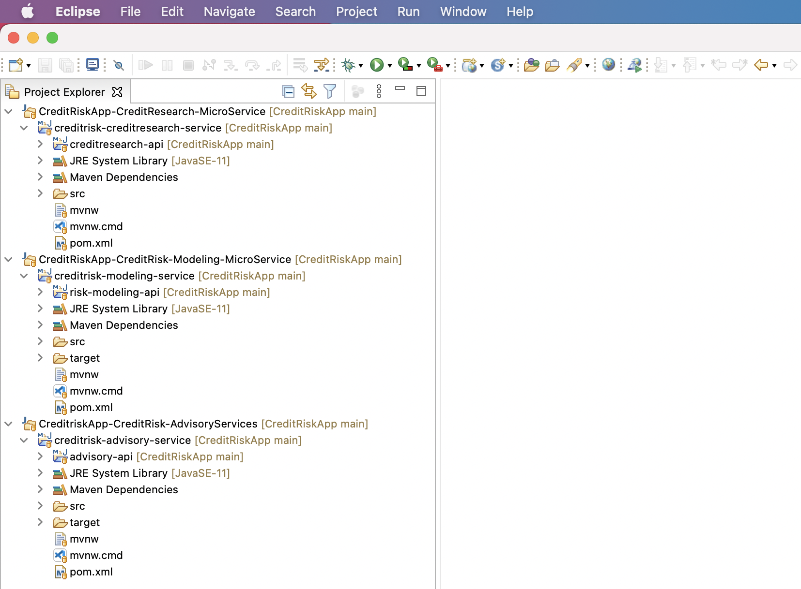

# Credit Risk Application
The purpose of this project is to adapt MicroServices to Credit Risk domain. This is a simple application with each Microservice exposing REST API end points that returns various products related to Credit Risk solutions.

But the with primary focus of this project is more on technology than on Credit Risk domain. So, the technology focused aspects in this codebase are:
- MicroServices design patterns
- Java 8 Streams / Functional Programming
- Kafka streaming architecture
- CI/CD DevOps practices like Jenkins, Azure DevOps, Kubernetes
- Serverless technologies, Functions As a Service
- Cloud services like AWS, GCP, Azure and more.
- Angular, React, JWT

# Multiple MicroServices Projects setup
This codebase have following Microservices
- creditrisk-advisory-service
- creditrisk-creditsearch-service
- creditrisk-modeling-service

## Tools Versions
Following tools and versions are used to create and maintain this codebase:

| Tool Name        	| Version           | Commands           	| Additional Notes   							|
| ---------------- 	|-------------------| ----------------------|-----------------------------------------------|
| Java JDK     	   	| 11                | 						|  					 							|
| Apache Maven     	| 3.8.1             | 						|  https://www.baeldung.com/maven-wrapper		|
| mvnw Maven Wrapper|               	|  						|												|
| Eclipse IDE      	| 2021-06 (4.20.0)  | 						|  					 							|
| Jenkins Server   	| 2.249.1  		   	| 						|  					 							|
| Docker   		   	| 	     		   	| 						|  					 							|

## Maven Projects creation
- Created Eclipse Working Set for each of the Microservice
- Using Eclipse -> New Project -> Maven -> maven-archetype-quickstart, created all MicroServices Java projects

### Maven Wrapper (mvnw) commands
Below mvnw (Maven Wrapper) commands are executed only after the above MicroServices Maven projects created.


```sh

	cd CreditRiskApp
	mvn -N io.takari:maven:wrapper


	cd CreditRiskApp/microservices/creditrisk-modeling-service
	mvn -N io.takari:maven:wrapper	

	cd CreditRiskApp/microservices/creditrisk-advisory-service
	mvn -N io.takari:maven:wrapper	

	cd CreditRiskApp/microservices/creditrisk-creditresearch-service
	mvn -N io.takari:maven:wrapper	

```




# Jenkins Server Docker Container codebase