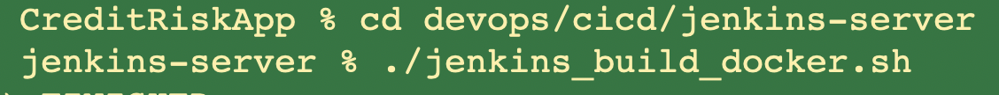
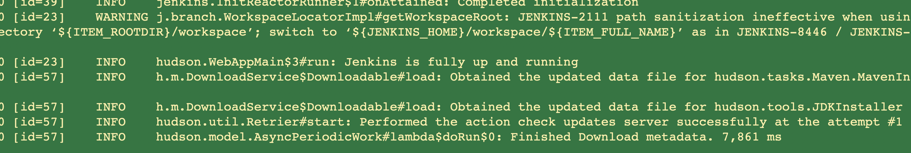
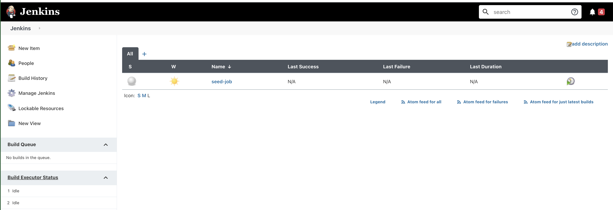
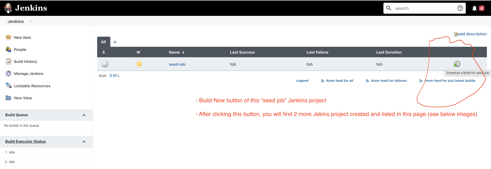

# CreditRiskApp Jenkins Server

A Docker container based Jenkins Server with pre-configured "SeedJob" Jenkins project to setup the CreditRiskApp codebase CI/CD pipeline project(s).

You can access this Jenkins Server (after Docker container running) at http://localhost:8080

## Important Note:
> In summary, after following below mentioned steps, you will have a CI/CD pipeline Jenkins project being created automatically. This automatically created Jenkins project uses this codebase GitHub URL as SCM URL and builds the CI/CD stages for this codebase.

# Table of contents
1. [Jenkins Docker Container build/start/stop/restart/remove scripts](#jenkins-docker-container)
2. [Jenkins Plugins Installation](#jenkins-plugins-installation)
3. [Jenkins Docker Image Creation](#jenkins-docker-image-creation)
4. [Seed Job Jenkins Project](#seed-job-jenkins-project)
5. [Maven Projects creation](#maven-projects-creation)


## 1. Jenkins Docker Container build/start/stop/restart/remove scripts <a name="jenkins-docker-container"></a>

Following are the bash scripts you will find in this codebase to build/start/stop/restart/remove the Docker container based Jenkins server

- ./jenkins_build_docker.sh - creates the Docker image for this codebase Jenkins server
- ./jenkins_start_docker.sh - starts the Docker container with Jenkins server for the first time
- ./jenkins_restart_docker.sh - restarts the already created Docker container with Jenkins server
- ./jenkins_stop_docker.sh - stops the already running Docker container with Jenins server
- ./jenkins_remove_docker.sh - removes the created Docker container with Jenins server and its Docker image

Figure for Jenkins Docker Image build creation.


Figure for Jenkins Docker Container running first time. Watch message "hudson.WebAppMain$3#run: Jenkins is fully up and running".


Figure for Jenkins Docker Container home page when accessed in browser http://localhost:8080


Figure for Jenkins "seed job" project and its "Build Now" icon



## 2. Jenkins Plugins Installation <a name="jenkins-plugins-installation"></a>

- In this codebase, you find plugins.txt. This text file contains all the additional plugins you like to automatically installed when the Docker based Jenkins Server is "up & running" for the first time

- In Dockerfile, you find above plugins.txt file is read and Jenkins Install Plugins command line tool is executed during this codegase Jenkins's Docker container image creation

## 3. Jenkins Docker Image Creation <a name="jenkins-docker-image-creation"></a>

Execute below commands to create the Jenkins Docker image with this codebase additional Jenkins configuration and default Jenkins Seed Project creation.

```sh

# Assuming you are in the root folder of this Github project codebase i.e. CreditRiskApp folder

cd devops/cicd/jenkins-server

# Note: Below remove bash script might give error if you are running for the first time. This error because of non-availability of this codebase specific Jenkins Docker container or Docker Image
./jenkins_remove_docker.sh 

# Command to create this codebase specific Jenkins Docker Image with default Seed Project creation
./jenkins_build_docker.sh

# After executing below "run" script, you see a log "hudson.WebAppMain$3#run: Jenkins is fully up and running"
./jenkins_run_docker.sh

# Now open browser and access the Jenkins Server at http://localhost:8080

# To stop the Jenkins docker container
./jenkins_stop_docker.sh

# To remove the Jenkins docker container and also Jenkins Docker image
./jenkins_remove_docker.sh

```

## 4. Seed Job Jenkins Project

- In this codebase, you find seedJob.xml. This is "seed-job" Jenkins project's XML configuration, in Jenkins XML syntax. This "seed-job" is a default Jenkins Project that is available when you run the Jenkins server using the shell scripts of this codebase.

- In Dockerfile, you find above seedJob.xml is copied as seed-job/config.xml inside Jenkins installation

- When you run Docker container and access Jenkins server at http://localhost:8080, you will find "seed-job" Jenkins project already created

- This "seed-job" project responsibility is, when you click on "Build Now" Jenkins button/icon in this Jenkins runtime, it builds i.e. creates another Jenkins projects by reading the configuration in the createJobs.groovy of this codebase. 

- Alternative explanation for the aboint point is, using Jenkins runtime tools, that are configured in "seed-job" project, we are creating another Jenkins projects that configured CI/CD pipelines for CreditRiskApp Maven projects. 

- Through the above approach, we can automatically setup all the Jenkins project stages for this CreditRiskApp codebase.


## 5. About createJobs.groovy

- In seedJob.xml you can find "hudson.plugins.git.GitSCM" configured to this codebase Github URL.

- Purpose for the above GitSCM is to checkout this Github codebase and run the CI/CD pipeline commands based on the "Jenkinsfile" that is available at the root of this codebase.

- This createJobs.groovy is invoked by the above GitSCM project's "builders" configuration.

- Read the "seedJob.xml" file for more understanding of what will happen when you click on the "Build Now" button in the Jenkins server UI of this codebase.

- After successful execution of "Build Now" button in the "seed job" Jenkins project UI, you will find additional two more Jenkins projects being created automatically.

- One of the above automatically created Jenkins projects is CI/CD pipeline for this CreditRiskApp codebase.
